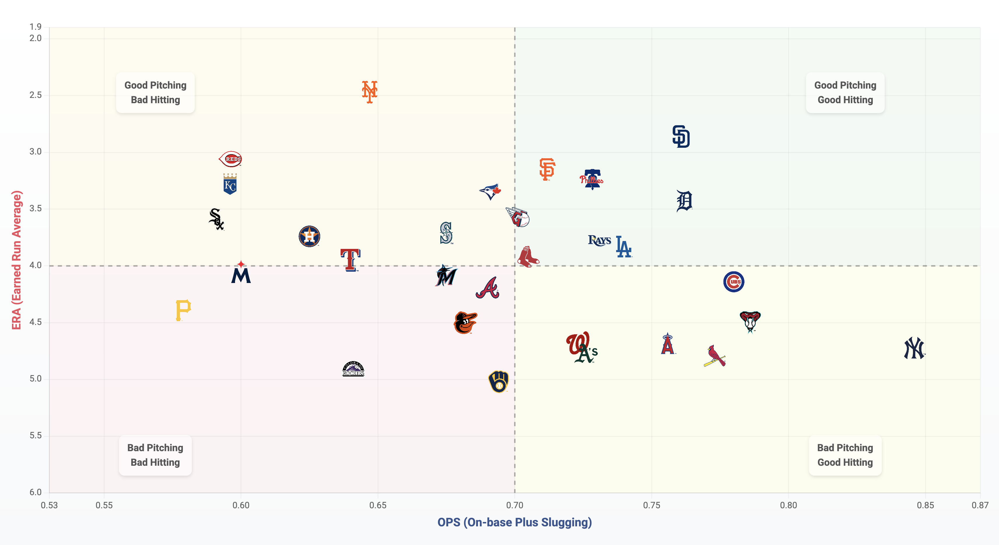

# MLB ERA vs OPS Visualization

An interactive web application that visualizes Major League Baseball team performance by plotting Earned Run Average (ERA) against On-base Plus Slugging (OPS) in a dynamic scatter plot with division filtering.



## 🎉 Ready for 2026 Season!

The app now automatically tracks seasons, shows full-year historical trends, and manages its own database with zero manual maintenance required. Perfect for free-tier Render deployments.

## 📊 Overview

This tool helps baseball analysts and fans visualize team performance by placing teams in quadrants based on their ERA (pitching effectiveness) and OPS (offensive production):

- **Good Pitching, Good Hitting**: Teams excelling in both areas (low ERA, high OPS)
- **Good Pitching, Bad Hitting**: Teams with strong pitching but weaker offense
- **Bad Pitching, Good Hitting**: Teams with strong offense but weaker pitching
- **Bad Pitching, Bad Hitting**: Teams struggling in both areas

## 🚀 Features

- **Interactive Scatter Plot**: Teams displayed with official team logos
- **Division Filtering**: Toggle visibility of specific MLB divisions
- **Season Selector**: Switch between 2025, 2026, and future seasons
- **Quadrant Analysis**: Color-coded backgrounds for performance zones
- **Full Season History**: View complete year-long trends (365+ days) with animated lines on hover
- **Smart Data Loading**: Always shows fresh data during season, cached data during off-season
- **Self-Managing Database**: Automatic schema migration, metadata backfill, and cleanup
- **Responsive Design**: Works on desktop and mobile devices

## 📈 Understanding the Metrics

### ERA (Earned Run Average)

ERA measures a pitcher's effectiveness by calculating how many earned runs they allow per nine innings pitched. Only runs scored without the benefit of defensive errors count as "earned." Lower ERA values indicate better pitching performance.

- **Excellent**: ≤ 3.00
- **Good**: 3.00-4.00
- **Average**: 4.00-5.00
- **Poor**: 5.00+

### OPS (On-base Plus Slugging)

OPS combines on-base percentage (how often a batter reaches base) and slugging percentage (total bases divided by at-bats) to provide a comprehensive view of offensive performance. Higher OPS values indicate better hitting.

- **Excellent**: .900+
- **Good**: .800-.899
- **Average**: .700-.799
- **Poor**: ≤.699

## 🏗️ Technical Architecture

- **Backend**: Python Flask web application
- **Database**: SQLite (development) / PostgreSQL (production with Supabase)
- **Frontend**: JavaScript with Chart.js for visualization
- **Data Source**: MLB Stats API via MLB-StatsAPI package
- **Auto-Maintenance**: Self-managing database with intelligent cleanup and retention
- **Deployment**: Optimized for Render free tier - zero manual intervention

## 🛠️ Installation

1. Clone the repository:
   ```bash
   git clone https://github.com/yourusername/eravsops.git
   cd eravsops
   ```

2. Create a virtual environment and activate it:
   ```bash
   python -m venv venv
   source venv/bin/activate  # On Windows: venv\Scripts\activate
   ```

3. Install dependencies:
   ```bash
   pip install -r requirements.txt
   ```

4. Create a `.env` file with your configuration:
   ```
   FLASK_ENV=development
   SECRET_KEY=your-secret-key
   CACHE_TIMEOUT=3600
   ```

5. Run the application:
   ```bash
   python main.py
   ```

6. Open your browser and navigate to http://localhost:5000

## 🐳 Docker Deployment

You can also run the application using Docker:

```bash
docker-compose up
```

This will start both the web application and a PostgreSQL database container.

## 📱 Customization

- **Division Filtering**: Toggle divisions by clicking on the division buttons at the top of the chart
- **Logo Size**: Adjust the `--logo-width` variable in CSS
- **Quadrant Colors**: Modify the `quadrantColors` object in `chart.js`
- **Chart Dimensions**: Change scales in the Chart.js configuration
- **Boundary Lines**: Adjust the `axisLines` values in `chart.js`

## 📂 Project Structure

```
eravsops/
├── main.py                     # Entry point for the application
├── config.py                   # Configuration settings
├── Procfile                    # For Render deployment
├── render.yaml                 # Render configuration
├── runtime.txt                 # Python version specification
├── requirements.txt            # Project dependencies
├── .env.example                # Example environment variables
├── app/
│   ├── __init__.py             # App initialization
│   ├── models/                 # For data models
│   ├── routes/                 # Route definitions
│   ├── services/               # Business logic and data fetching
│   ├── static/                 # Static assets
│   │   ├── css/
│   │   ├── js/
│   │   └── logos/              # Team logos directory
│   └── templates/              # Jinja2 templates
└── data_cache.json             # Cache file for API responses
```

## 📊 Division Filtering

The application includes a division filtering feature that allows you to:

- Toggle visibility of specific MLB divisions (AL East, AL Central, AL West, NL East, NL Central, NL West)
- Visually compare teams within the same division
- Focus analysis on specific leagues or regions
- See division-specific trends in pitching and hitting performance

## 📄 License

This project is licensed under the MIT License - see the LICENSE file for details.

## 🙏 Acknowledgements

- [Chart.js](https://www.chartjs.org/) for the visualization library
- [Flask](https://flask.palletsprojects.com/) for the web framework
- [MLB-StatsAPI](https://github.com/toddrob99/MLB-StatsAPI) for MLB data
- MLB for team information and statistics